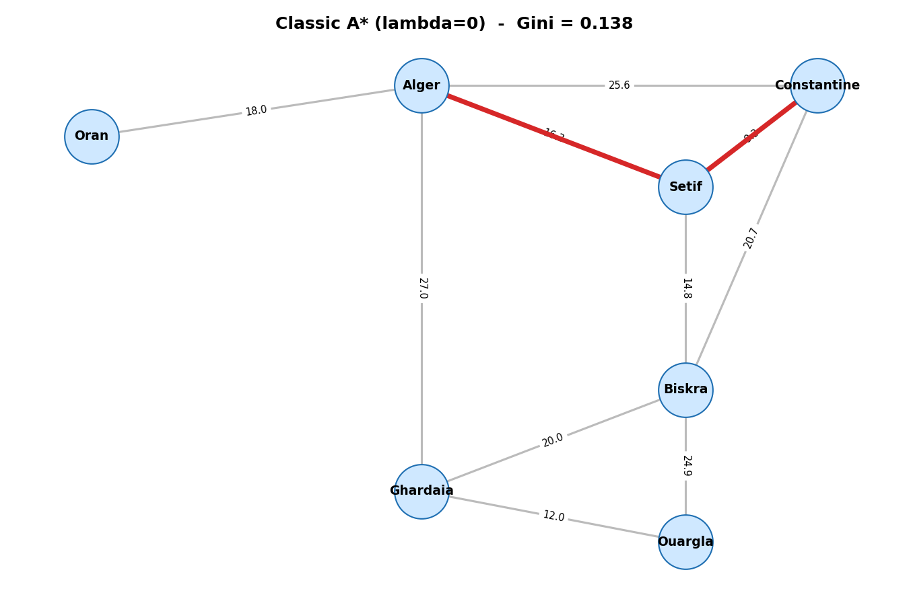
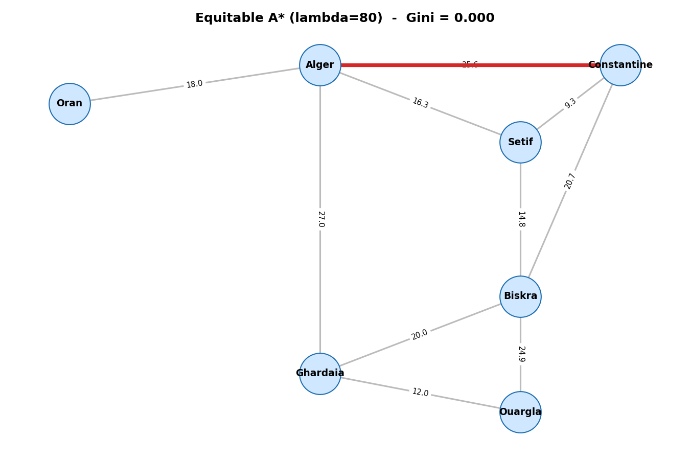

# dss-pathfinding-ahp-hurwicz-gini
# Multi-Criteria Pathfinding under Uncertainty

> A hybrid **A\*** algorithm that integrates **AHP**, the **α-Hurwicz criterion**, and the **Gini equity coefficient** to find the best route in a network of Algerian cities under multiple, uncertain, and fairness-aware criteria.

**Decision Support Systems (DSS)** — University of Algiers 1, Benyouçef Benkhedda
**Authors:** Youcef Bouzid · Yanis Atek · Academic Year 2025/2026

---

## Overview

A classic shortest-path algorithm minimizes a single quantity (distance or time).
In practice, a route depends on several conflicting criteria, the cost of each road
is uncertain, and two routes with the same average cost are not equally safe.

This project builds a Decision Support System that handles all three aspects in four stages:

1. **AHP** — weights the decision criteria (Saaty 1–9 scale + consistency check).
2. **α-Hurwicz** — blends the best-case and worst-case cost of each road into one risk-adjusted cost.
3. **Gini coefficient** — measures how evenly cost/risk is spread along a route.
4. **Hybrid A\*** — finds the route minimizing `cost + λ · Gini`.

---

## Method

The criteria are weighted with AHP:
g_equitable(n) = Σ EC_ij + λ · Gini({EC_ij})
f(n)           = g_equitable(n) + h(n)
where each edge cost `EC` is obtained from the Hurwicz blend
`EC = α · Min_Cost + (1 − α) · Max_Cost`, and `h(n)` is an admissible
Euclidean heuristic (straight-line distance × minimum cost per unit).

When `λ = 0` the system behaves like a classic A\*. Increasing `λ`
pushes the search toward fairer, more balanced routes.

---

## Results

Search from **Alger → Constantine**:

| Method | Route | Base cost | Gini |
|--------|-------|-----------|------|
| Classic A\* (λ = 0) | Alger → Setif → Constantine | 25.55 | 0.138 |
| Equitable A\* (λ = 80) | Alger → Constantine | 25.64 | **0.000** |

The equity-aware search removes the cost concentration for only **+0.09** in total cost.

| Classic A\* (λ = 0) | Equitable A\* (λ = 80) |
|:---:|:---:|
|  |  |

---

## How to run

```bash
pip install numpy matplotlib networkx
python main.py     # prints the full decision report
python plot.py     # saves route_classic.png and route_equitable.png
```

---

## Project structure

| File | Role |
|------|------|
| `ahp.py` | Criteria weights + Consistency Ratio (AHP) |
| `hurwicz.py` | Risk-adjusted edge cost (α-Hurwicz) |
| `gini.py` | Equity coefficient |
| `data.py` | City graph + cost construction |
| `astar.py` | Hybrid A\* search with Gini penalty |
| `main.py` | Orchestration / full pipeline |
| `plot.py` | Graph visualization |

---

## References

- Course material, DSS — Chapter 1 (Hurwicz α-Index) and Chapter 3 (AHP), University of Algiers 1.
- Saaty, T. L. *The Analytic Hierarchy Process*. McGraw-Hill, 1980.
- Hart, Nilsson, Raphael. *A Formal Basis for the Heuristic Determination of Minimum Cost Paths*. IEEE, 1968.
